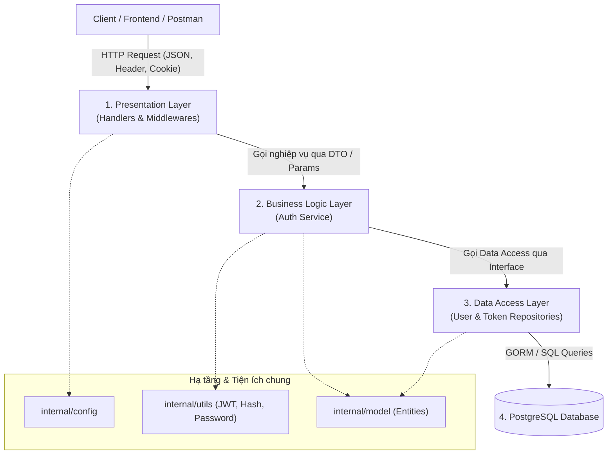
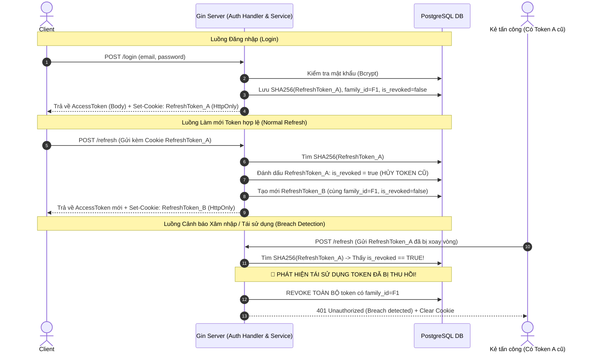
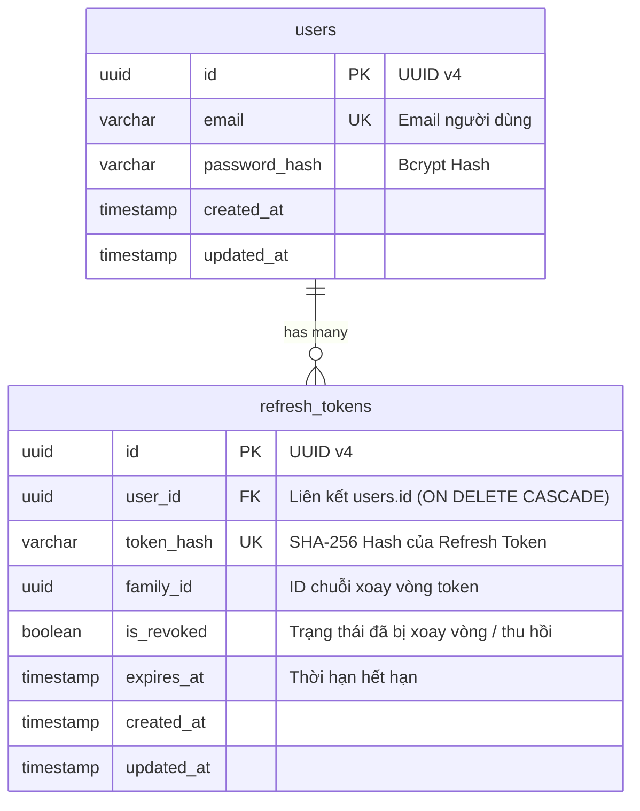

# Tài liệu Kiến trúc & Công nghệ (Architecture & Tech Stack)

Dự án này là hệ thống xác thực (Authentication System) hoàn chỉnh được xây dựng bằng **Go** và **Gin Framework**, kết hợp **PostgreSQL**, **JWT**, **HttpOnly Cookie**, và cơ chế **Refresh Token Rotation (RTR)** với **Phát hiện tái sử dụng token (Reuse & Breach Detection)**.

---

## 🛠️ 1. Tech Stack (Công nghệ sử dụng)

| Thành phần | Công nghệ / Thư viện | Vai trò |
|---|---|---|
| **Ngôn ngữ** | `Go (Golang 1.22+)` | Ngôn ngữ lập trình chính, hiệu năng cao, tối ưu concurrency |
| **Web Framework** | `Gin Gonic (github.com/gin-gonic/gin)` | HTTP Router và Web Framework nhanh, nhẹ |
| **Database** | `PostgreSQL 16` | Cơ sở dữ liệu quan hệ (RDBMS) lưu trữ người dùng và token |
| **ORM / Migration** | `GORM (gorm.io/gorm)` + `gorm.io/driver/postgres` | Object-Relational Mapping & Auto Migration schema |
| **JWT** | `golang-jwt/jwt/v5` | Tạo, ký (HMAC-SHA256) và xác thực Access Token |
| **Mã hoá mật khẩu** | `golang.org/x/crypto/bcrypt` | Băm mật khẩu một chiều an toàn với muối ngẫu nhiên (Salt) |
| **Sinh chuỗi ngẫu nhiên** | `crypto/rand` + `crypto/sha256` | Sinh Refresh Token ngẫu nhiên 256-bit và băm SHA-256 lưu DB |
| **Định danh duy nhất** | `github.com/google/uuid` | Khóa chính UUID v4 cho User, Refresh Token và Family ID |
| **Quản lý biến môi trường** | `github.com/joho/godotenv` | Đọc cấu hình từ file `.env` |
| **Containerization** | `Docker` & `Docker Compose` | Đóng gói và chạy môi trường PostgreSQL cục bộ |

---

## 🏛️ 2. Kiến trúc tổng thể (Clean Architecture / Layered Architecture)

Dự án áp dụng mô hình **Kiến trúc phân tầng (Layered / N-Tier Architecture)** tuân theo nguyên lý **Clean Architecture** và **Dependency Inversion (SOLID)**.



### Chi tiết trách nhiệm từng tầng:

### 1. Presentation Layer (Tầng Giao tiếp)
- **Thư mục**: `internal/handler/`, `internal/middleware/`
- **Trách nhiệm**:
  - Nhận HTTP Request từ client, parse JSON body, validate dữ liệu đầu vào (`binding:"required,email"`).
  - Quản lý **HttpOnly Cookies**: đọc `refresh_token` từ request cookie và gán `Set-Cookie` khi đăng nhập / refresh / logout.
  - Tầng này chỉ biết tới **Service Interface**, hoàn toàn không chứa logic truy vấn DB.
  - `middleware/auth_middleware.go`: Kiểm tra và giải mã JWT `Bearer <token>` từ header `Authorization`.
  - `middleware/cors_middleware.go`: Cho phép CORS và hỗ trợ `Access-Control-Allow-Credentials: true` để truyền nhận Cookie an toàn giữa các domain.

### 2. Business Logic / UseCase Layer (Tầng Nghiệp vụ)
- **Thư mục**: `internal/service/`
- **Trách nhiệm**:
  - Chứa toàn bộ quy tắc nghiệp vụ cốt lõi (Core Business Rules).
  - Xử lý quy trình **Refresh Token Rotation (RTR)**.
  - Thực hiện **Phát hiện tái sử dụng token (Token Reuse Detection)**.
  - Băm mật khẩu, sinh JWT Access Token, sinh chuỗi Refresh Token ngẫu nhiên.
  - Tầng này **hoàn toàn độc lập với Gin Framework**, không phụ thuộc `gin.Context`, giúp viết **Unit Test** độc lập cực kỳ dễ dàng.

### 3. Data Access Layer (Tầng Truy xuất Dữ liệu)
- **Thư mục**: `internal/repository/`
- **Trách nhiệm**:
  - Tương tác CRUD trực tiếp với Database.
  - Được trừu tượng hóa thông qua **Interface** (`UserRepository`, `TokenRepository`).
  - Cho phép dễ dàng thay đổi ORM (GORM sang `pgx`, `sqlc`, `sqlx`) hoặc Mock dữ liệu khi test mà không ảnh hưởng tới tầng Service.

### 4. Domain & Entity Layer
- **Thư mục**: `internal/model/`
- **Trách nhiệm**:
  - Định nghĩa các cấu trúc dữ liệu thực thể (`User`, `RefreshToken`).

---

## 🔒 3. Cơ chế Bảo mật & Luồng Xác thực

### A. Access Token vs. Refresh Token

```
┌─────────────────┬───────────────────────────────┬───────────────────────────────┐
│ Tiêu chí        │ Access Token                  │ Refresh Token                 │
├─────────────────┼───────────────────────────────┼───────────────────────────────┤
│ Định dạng       │ JWT (JSON Web Token HS256)    │ Chuỗi ngẫu nhiên 256-bit      │
│ Thời hạn (TTL)  │ Ngắn hạn (15 phút)            │ Dài hạn (7 ngày)              │
│ Vị trí lưu trữ  │ Client Memory / Auth Header   │ HttpOnly Secure Cookie        │
│ Lưu trữ phía DB │ KHÔNG lưu trong DB            │ Lưu bản BĂM SHA-256 trong DB  │
│ Mục đích        │ Xác thực truy cập tài nguyên  │ Cấp mới Access Token          │
└─────────────────┴───────────────────────────────┴───────────────────────────────┘
```

---

### B. Cơ chế Xoay vòng Token & Phát hiện xâm nhập (RTR with Reuse Detection)

Mỗi phiên đăng nhập của người dùng được gán một chuỗi token có chung **`family_id`**.



---

## 🗄️ 4. Thiết kế Cơ sở Dữ liệu (Database Schema)



---

## 📂 5. Cấu trúc thư mục chi tiết

```
golang/
├── cmd/
│   └── server/
│       └── main.go                 # Khởi tạo DI, Router, Middleware, Server Port
├── internal/
│   ├── config/
│   │   └── config.go              # Load biến môi trường (.env)
│   ├── database/
│   │   └── database.go            # Kết nối PostgreSQL & GORM AutoMigrate
│   ├── handler/
│   │   └── auth_handler.go        # HTTP Handlers (Register, Login, Refresh, Logout, Me) & Cookie
│   ├── middleware/
│   │   ├── auth_middleware.go     # Middleware chặn và xác thực Access Token JWT
│   │   └── cors_middleware.go     # CORS Middleware hỗ trợ credentials / HttpOnly cookie
│   ├── model/
│   │   ├── user.go                # Entity User
│   │   └── refresh_token.go       # Entity RefreshToken
│   ├── repository/
│   │   ├── user_repository.go     # Interface & Implementation truy vấn bảng Users
│   │   └── token_repository.go    # Interface & Implementation truy vấn & thu hồi chuỗi token
│   ├── service/
│   │   └── auth_service.go        # Nghiệp vụ xác thực, RTR, băm mật khẩu, sinh JWT
│   └── utils/
│       ├── jwt.go                 # Ký / Xác thực JWT, sinh chuỗi random, tính SHA-256
│       └── password.go            # Băm và so khớp mật khẩu bằng Bcrypt
├── .env                           # File cấu hình môi trường chạy cục bộ
├── .env.example                   # Mẫu cấu hình môi trường
├── docker-compose.yml             # Chạy PostgreSQL qua Docker
├── go.mod                         # Quản lý Golang dependencies
├── ARCHITECTURE.md                # Tài liệu kiến trúc & công nghệ (File này)
└── README.md                      # Hướng dẫn chạy và gọi API mẫu
```
